# 第二课 马尔科夫决策过程

课程ppt已上传为pdf。

## 马尔科夫决策过程介绍

* 马尔科夫决策过程形式上定义了强化学习的环境
* 这个环境是完全可观察的
* 当前的状态可以完全的表示过程
* 几乎所有的强化学习问题都可以转化为马尔科夫决策过程

## 马尔科夫性质

* 前一课笔记已经说过了，马尔科夫性质就是未来的状态只依赖于当前，与过去无关。

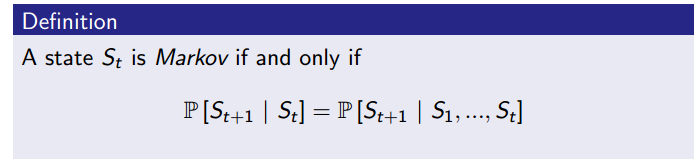

* 状态捕捉了历史中所有相关的信息，所以知道了状态，历史(history)就可以完全丢弃了
* 状态是未来的充分统计

## 状态转移矩阵

状态转移矩阵是马尔科夫过程中状态之间转移的概率所组成的矩阵，因此大小是状态数n的平方。

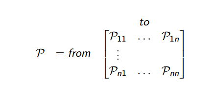

显然，每一行和为1

## 马尔科夫过程

马尔科夫过程是一个无记忆的随机过程。就像是一序列随机的满足马尔科夫性质的状态S1，S2，S3，...

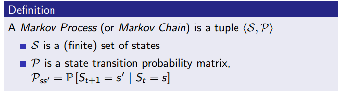

举个例子，学生马尔科夫过程，马尔科夫过程也叫马尔科夫链。如下图：

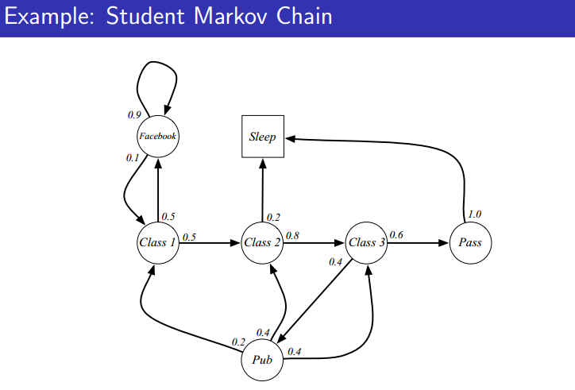

图中包含了马尔科夫链的两个元素<S，P>，状态和状态转移矩阵。本例中，状态转移矩阵如下：

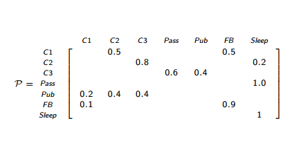

## 马尔科夫奖励过程

原本的马尔科夫过程加上奖励值之后就变成了马尔科夫奖励过程，元素由<S,P>变为<S,P,R,gamma>，
其中R就是奖励，gamma是折扣因子。

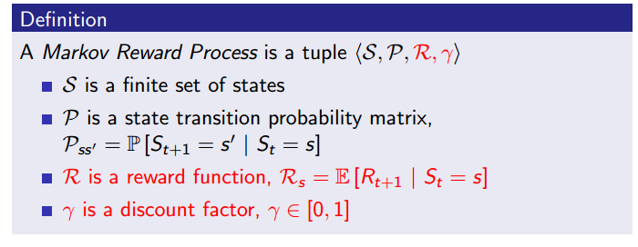

所以之前的学生马尔科夫过程相应的变成马尔科夫奖励过程，

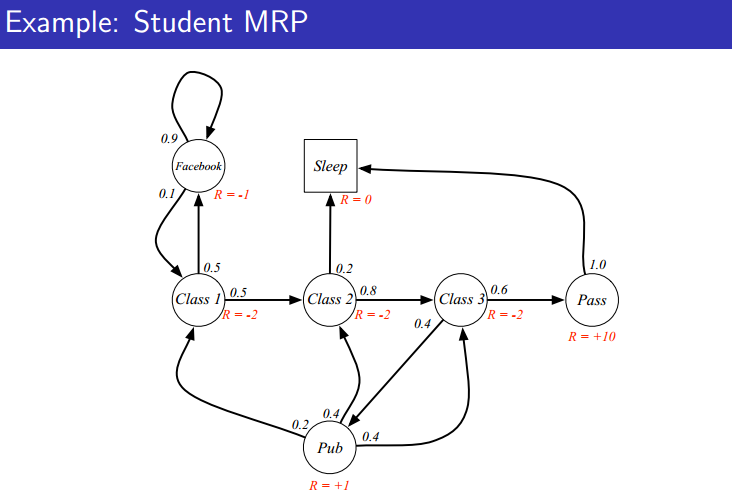

红色标注的值就是奖励，注意的是，这里的奖励是即时奖励，也就是脱离状态时立刻得到的奖励，
无论你下个状态是什么。

## 回报

回报是从相应时间t开始以后的总的折扣奖励之和。

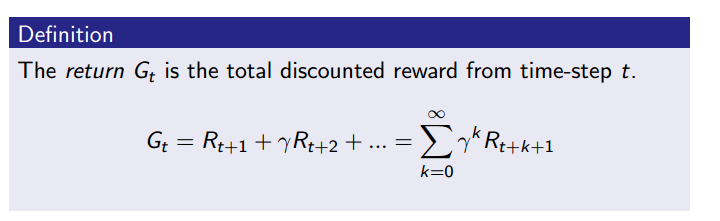

折扣因子在0和1之间，越靠近0，代表越近视，越注重眼前的利益，反之越接近1，代表眼光越长远，
这里并不代表不再看重眼前利益了，而是对未来的奖励和眼前的利益看重程度更加接近了。极限情况就是1，
代表对未来和现在一视同仁。

加入折扣因子的原因大致如下：
* 数学上计算的方便
* 避免未来进入循环马尔科夫过程带来的无限大回报
* 未来的不可靠性
* 类比经济学中，眼前的利益比未来的利益更加有意义
* 人类的行为也更加倾向于眼前利益
* 退一步来说，令gamma为1，也可以简单的转化成没有折扣因子的状态

## 价值函数

价值函数是状态S的长期价值表示。它是上面说的回报的期望。

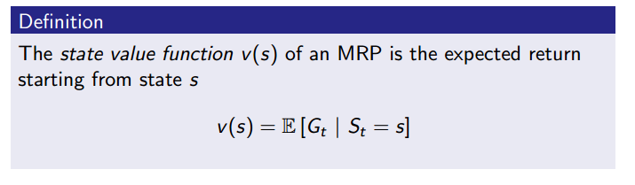

它也会随着折扣因子的变化而取不同的值，因为回报会因为gamma的值而改变，期望自然也就会改变。

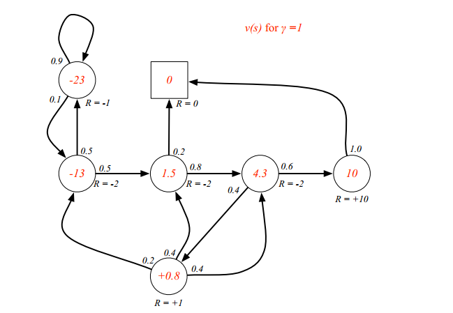

上图是gamma为1时，学生马尔科夫奖励过程，红色的就是状态的价值。

PS:暂时可以不必纠结上面的价值是怎么算出来的.通过价值函数的公式我们可以知道,要想求解一个状态的状态价值,
需要根据马尔科夫链把所有的可能列出来,每个可能都在终点终止,但是上面这个马尔科夫过程其实是有环的,
可能陷入无限循环的局面,因为折扣因子还是1,所以会导致回报G无限大,期望也就无限大,状态价值V也就无限大.
下面引入贝尔曼方程就是为了更好的求解价值函数的.

## 马尔科夫奖励过程的贝尔曼方程

贝尔曼方程用来方便的表示和计算马尔科夫奖励过程，价值函数可以分为两个部分;
* 即时奖励
* 下一状态的折扣状态价值

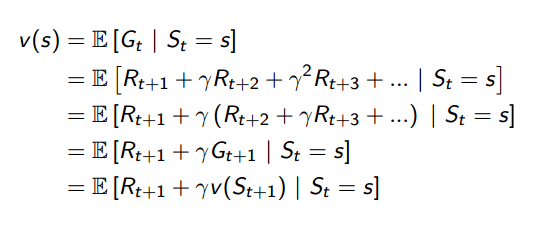

上面是贝尔曼方程的简单推导，比较简单，就不多说了。

我们可以用一种树的方式更好的理解贝尔曼方程的计算。


这样计算的话，我们试试验证刚才上面的学生马尔科夫奖励过程中的价值是否正确。

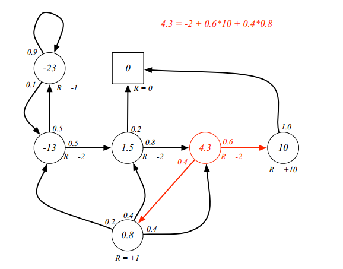

红色的部分计算发现没有问题，可以自行计算其他位置，都没有问题。

贝尔曼方程还可以表示成矩阵的形式，并且可以直接求逆进行计算：

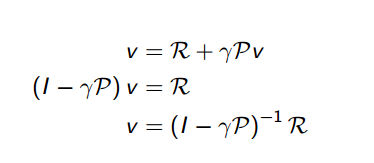

但是可惜的是，有几个问题;
* 计算复杂，O(n3)复杂度
* 只能用于小型的MRP，即马尔科夫奖励过程

所以对于大型的MRP，一般用迭代的方式求解贝尔曼方程：
* 动态规划
* 蒙特卡洛方法
* 差分学习法

## 马尔科夫决策过程MDP

到目前为止其实我们都没有讲到强化学习，因为我们虽然对原始的MP引入了奖励R，变成了MRP，可是我们并没有
决策的部分，强化学习本身是一个决策的问题。所以现在我们再引入一个因子，就是Action，动作，MRP变成了
MDP，此时才能算得上是强化学习。MDP是一个环境，里面的每个状态都满足马尔科夫性质。

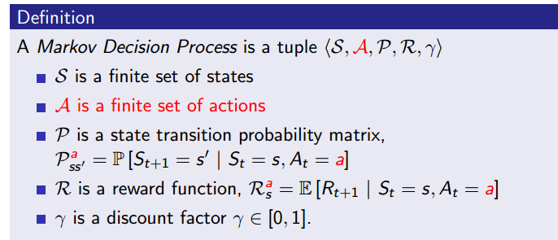

老规矩，上面的学生马尔科夫奖励过程中也加入A，变成学生MDP。

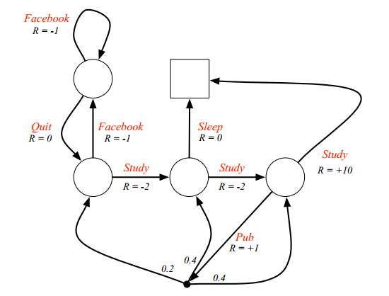

红色的部分就是Action。

PS:这里需要注意的是,因为有了动作的加入,奖励不再只和状态相关,还和动作有关.之前的奖励是离开状态就获取的即时奖励,现在是
在某个状态下采取特定动作后获取的即时奖励.

## 策略policy

策略是状态到动作的映射，在某个状态下采取什么样的动作，可以是确定的策略，也可以是一个概率事件。

* MDP的策略只依赖于当前的状态，不依赖于history
* 策略是静态的，不受时间约束

## 价值函数

MDP的价值函数和MRP的有一些不同，与策略相关。正因为有了策略,价值函数不再单纯的只和状态S相关了,采取不同的策略,
价值函数也会不同,因为从贝尔曼方程中我们也能看出,价值的计算和动作相关,而动作的选择就是策略.但是这里不得不提一下,
这里的价值函数只是策略的价值函数,它的好坏不一定代表真正的状态的好坏,它只是根据你提供的这个策略计算出来的,你的这个
策略不一定是一个好策略,那么自然计算出来的价值不一定具有很强的参考性.

```
我们更希望的是最优价值函数,最优价值函数是与策略无关的,根据最优价值函数,我们可以直接得到最优策略,只需要沿着状态价值函数大的
方向移动就行,这其实也就是强化学习中的一个流派,基于价值学习的(相对于基于策略学习).价值比较大的状态就是好,比如终点前的一个状态,
状态价值一般就比较大,因为下一刻就可以结束.(此处用"一般"是因为考量的是状态价值,如果这个状态不仅和终点相连,还和几个失败点相连
,状态价值不一定大,参考贝尔曼方程计算公式.如果我们使用另一种价值函数的话,就是q值,代表状态S下采取特定动作A的价值,那么我们就可以说
,终点前一个状态,采取动作A可以直接到终点,这个q(S,A)一定是一个大值,这边也提示了大家使用q值一般比使用状态价值V(s)更好,因为考虑了动作
,这两个价值函数下面就说到)

```

价值函数还分为状态价值函数和动作价值函数，定义如下：(可以看到都有个下标π,代表策略相关)

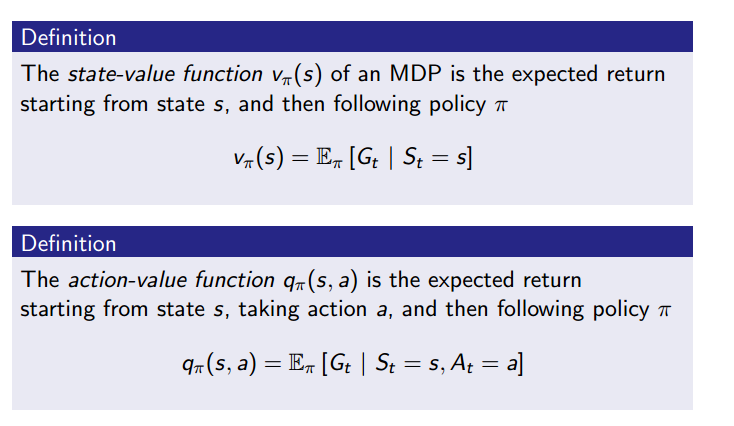

学生MDP的状态价值如下图：(这里假设策略是一个随机策略,π(a|s)=0.5,每个状态下每个动作选择的概率是0.5)

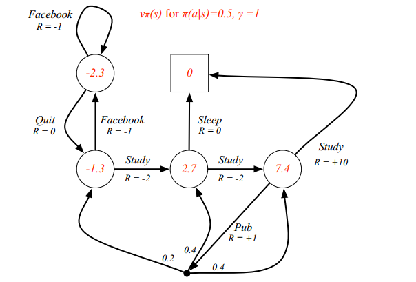

## 贝尔曼期望方程

和MRP类似，贝尔曼期望方程用来表示MDP。

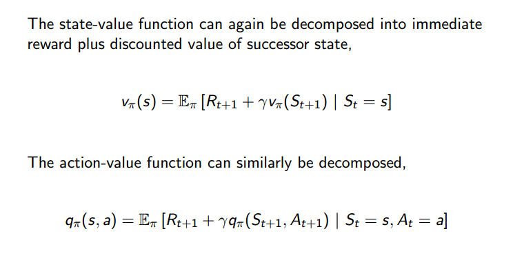

同样类似的，可以用类似树结构来理解：

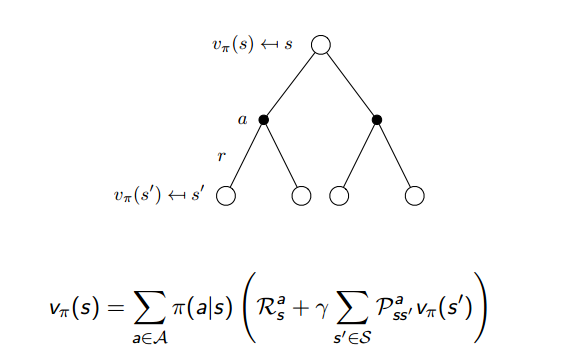

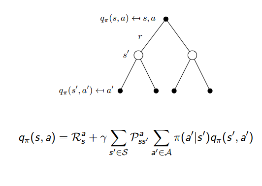

不同得是，从之前的看一步，到现在的看两步。黑色的点就是Q，白圈就是V。

也可以表示成矩阵的形式并直接求逆求解，问题同前面的一样。

## 最优价值函数

从现在开始要把基于策略的价值函数和最优价值函数联系起来了,如果搞不清区别,还需要把我前面介绍的那段话好好看看,很重要.
因为我发现很多人对这里都是很模糊的,单纯记个公式,理解不到位.

定义如下，最优价值函数指定了在MDP中可能的最好表现：

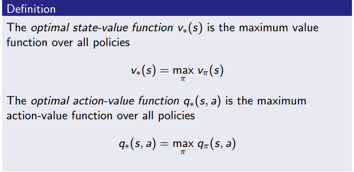

每个策略都有可以计算出一个价值函数,在所有策略中最大的价值函数就是最优价值函数(最优状态价值函数和最优动作价值函数).
这既是最优价值函数的定义,同时也是计算方法,取所有策略下的价值函数的最大值.
也就是说我们可以通过求解最优策略来间接求解最优价值函数,最优策略下的价值函数就是最优价值函数.

所以我们说知道了最优函数，不管是状态价值函数还是动作价值函数，MDP问题就解决了。
或者说这个强化学习问题就解决了。因为我们只需要挑最优的路径就行了(怎么挑呢?自然是选下一个Q值最大的动作,或者下一个状态价值最大的状态)。

## 最优策略

前面说到最优策略可以用来求最优价值,那么最优策略到底有没有呢?最优策略存在定理告诉我们最优策略必然存在,而且可能不止一个,
但是放心,每个最优策略都可以获得最优价值函数.最优策略下的状态价值函数就是最优状态价值函数,最优策略下的动作价值函数就是最优动作价值函数.

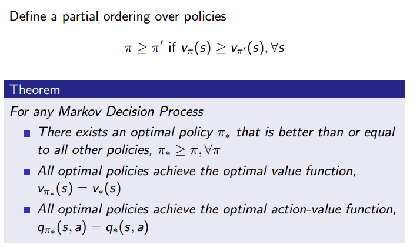


## 贝尔曼最优方程

根据前面最优价值函数的定义,直接取策略下最优价值的最大值,可以得到贝尔曼最优方程：

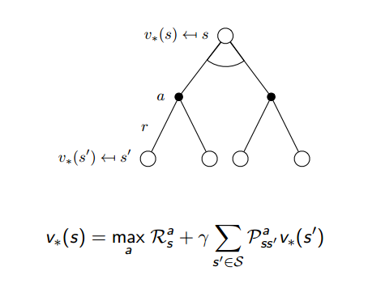

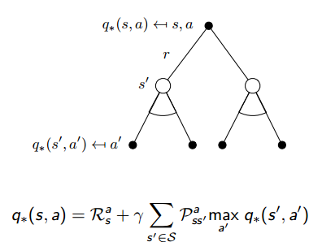

* 贝尔曼最优方程非线性的
* 没有直接的解法
* 迭代的解决办法
    
    * 价值迭代
    
    * 策略迭代
    
    * Q-learning
    
    * Sarsa


