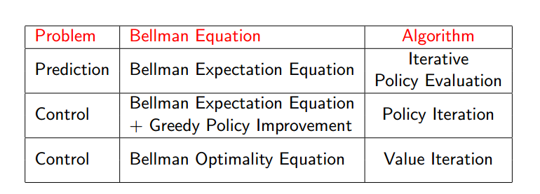
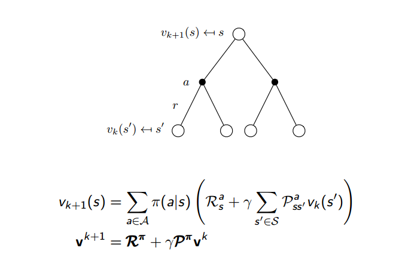
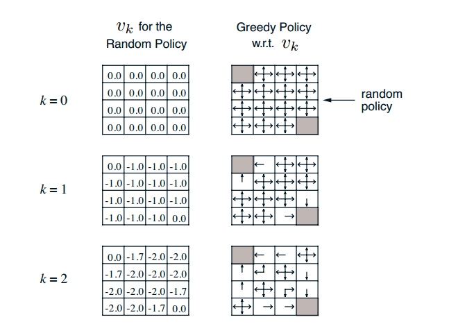
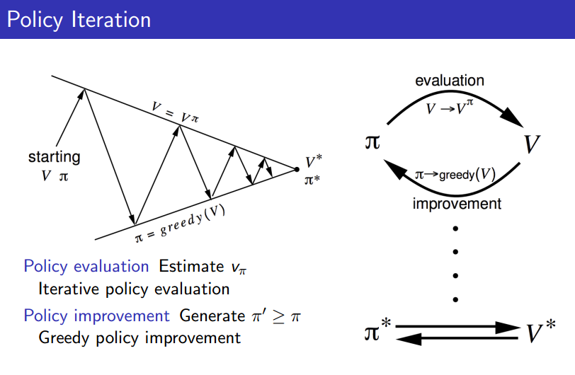
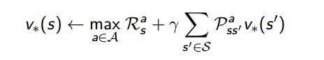

# 第三课 动态规划

课程ppt已上传为pdf

## 动态规划介绍

动态规划是一种很重要的算法了，它可以解决很多的问题，包括矩阵连乘问题，最长公共子序列问题等等。

要想使用动态规划来解决问题，首先问题得先具备几个特点：
* 最优子问题。也就是说问题可以分解成很多的子问题
* 重叠子问题。要求不仅可以分解为子问题，而且子问题重复出现很多次，解决方法因此可以被保存和重复利用

首先先回忆这节课为什么要介绍动态规划，是为了解决贝尔曼最优方程，因为贝尔曼最优方程是非线性的，不可以直接求解，
比如矩阵求逆之类的，因此我们采用动态规划来求解。解决贝尔曼最优方程的目的就是解决MDP问题，而MDP正好满足线性规划的要求：
* 最优子问题。MDP可以用贝尔曼方程来表示，而贝尔曼方程就是一种递归的分解
* 重叠子问题。价值函数正好存储了解决方法，而且可以重复使用

### 前提

动态规划说到底还是规划问题，RL中规划指的就是在行动之前进行Plan，既然没行动就可以plan了，那么最基本的要求就是
我们必须知道MDP的所有知识，包括状态转移矩阵和奖励函数之类的，不然我们是没法规划的。所以这是一种Model-besed的方法。

有两种目的，一种是为了预测，就是给出MDP<S,A,P,R,gamma>以及策略π的信息，预测价值函数Vπ。
另一个是为了控制，就是只给出MDP<S,A,P,R,gamma>，不给出策略，而让我们输出最优的策略π\*者最优的价值v\*。

### 主体

为了有一个大概的思路，我先给出下图，这就是这节课的主要部分：

涉及了三个算法，迭代策略评估，策略迭代，价值迭代。严格来说是两个因为策略评估是策略迭代的一部分。

## 迭代策略评估

从上面的表格中就知道，这是一个预测问题，也就是给出MDP和π，预测V。利用的贝尔曼期望方程。

先给出具体步骤（使用同步备份）：
* 在每一个迭代K+1
* 对每一个状态s属于S
* 利用vk（s'）更新vk+1（s）
* 其中，s'是s的下一个状态

然后不断循环迭代，一定可以迭代到Vπ，课程最后也给出了证明。

上图是利用贝尔曼方程的迭代策略评估的公式，区别就是是利用上一轮迭代的s'去更新现在这一轮的s，
其实很合理，因为本轮的s'的价值还没有算出来，无法拿出来更新的。

课上David用了一个例子：小方格世界 来说明这个迭代策略评估，非常形象易懂。我这里简单分析一下：

上面先看左边一列，这才是迭代策略评估的本体，右边等下说到。

我们可以先初始化所有的状态价值为0，当然这里初始化为其他的值也是可以的，迭代到最后效果都是一样的。
然后第二轮迭代的时候利用第一轮的价值更新现在的价值，现在的策略是上下左右随机走，概率都是0.25，每走一步的
即时奖励都是-1，所以大部分的位置都是-1，也就是由上面的贝尔曼方程算出，具体是：0.25*(-1+0)+0.25*(-1+0)+0.25*(-1+0)+0.25*(-1+0)
左上角和右下角是终止点，也可想象成自循环，并且奖励为0，所以一直都是0，无论迭代多少次。

同理，下一轮的计算也一样，需要注意的是边上的状态，比如顶部的状态，在选择动作为上时，是停留在原地不动的，所以下一个状态就是本身。
这样一直迭代下去，就可以收敛。

再看右边这一列，一开始价值都为0，所以我们往那边走都是一样的，但是第一轮迭代后，价值不一样的，所以有些地方，我们倾向于选择价值增加的方向，
因此理论上，不再应该继续采取随机策略了，而应该采取右边这样的策略，这其实就是下一个算法策略迭代的思想，我们现在一直到迭代结束没有改变策略，
一直是随机策略。

## 策略迭代

受前一个算法的影响，我们可以在价值评估的过程中，不断修正我们的策略，也就是采用贪婪选择算法，但是有一个问题，这个修正看起来是短视的，只看到眼前，
我们能保证修改的策略比以前的更好吗？答案是可以的，ppt中有推导，我就不多说了，因此你们也可以抛开这个疑问了。

上图很清晰了，从初始化价值V和策略π开始，一直迭代，直到收敛到V\*,π\*。

因此策略迭代分为两步，一是策略评估，也就是评估你这个策略的价值函数，然后是策略提升，根据你的价值修改策略，具体是贪心选择算法。
然后不断迭代，直到收敛。

### 改进策略迭代

所谓的改进就是我们很多情况下不需要无限制的迭代下去，比如上面的小方格世界，迭代三轮就可以得出最优的策略了，后面的迭代相当于无用功。
因此我们需要提前中断迭代，怎么中断呢？有几种方式：
* 常用的是跟踪价值的更新大小，如果改变的值很小，小于我们的阈值，就结束
* 更简单的一种方式是直接指定迭代的轮次

### 一般策略迭代

更一般化的策略迭代，简而言之，就是策略评估算法和策略提升算法换成其他的算法。

## 价值迭代

价值迭代利用的是贝尔曼最优方程，更新公式如下：

就是贝尔曼最优方程，所以我们知道了子问题的最优解决方案V\*(s')，V\*(s)就可以通过上述公式向前看一步得到。

具体步骤（使用同步备份）：
* 在每一个迭代K+1
* 对每一个状态s属于S
* 利用vk（s'）更新vk+1（s）
* 其中，s'是s的下一个状态

和策略迭代表述一样。

