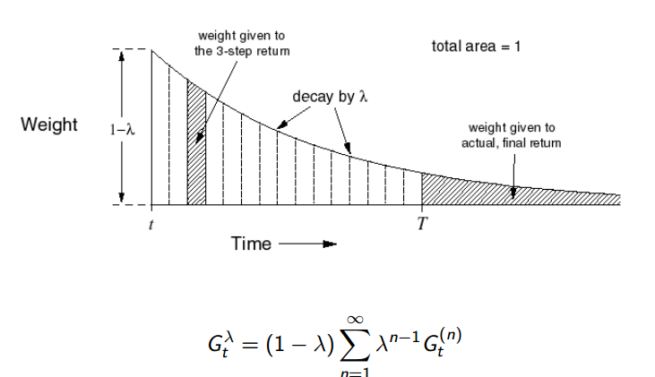
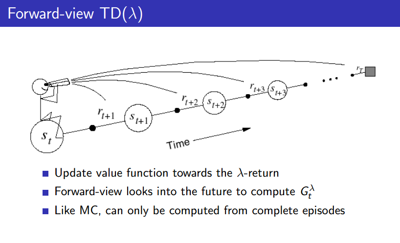
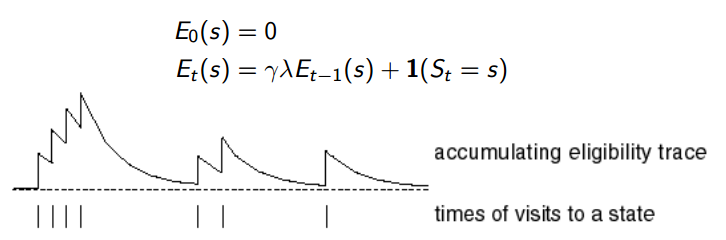
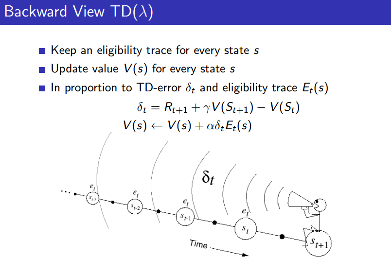
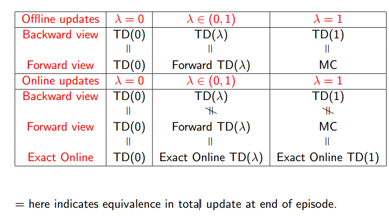

# 第四课 免模型预测

课程ppt已上传为pdf

## 免模型强化学习

这节课开始讲免模型强化学习，所谓免模型就是MDP是未知的，包括状态转移矩阵P和奖励R。至于上节课的动态规划方法，
也就是策略迭代和价值迭代都是基于模型的方法，其实也就是一种理想化的方法，它是建立在我们完全知晓MDP的情况下的。
但是我们都知道，在现实里，这种情况是不多的。

首先这节课主要是免模型预测，下节课讲解的是免模型控制。

## 蒙特卡洛方法(MC)

首先是免模型方法中第一种方法，也就是蒙特卡洛方法，了解算法的人都应该知道蒙特卡洛方法，它其实就是一种随机方法，
精髓在一个“蒙”字，本质其实是以频率逼近概率。

强化学习中的蒙特卡洛方法有如下特点：

* 直接从经验片段学习
* 是免模型的，不需要MDP 转移矩阵和奖励的知识
* 从完整的片段中学习，没有自助抽样学习(bootstrapping)
* 使用最简单的可能思想：价值等于平均回报
* 提醒：MC只能在片段化的MDP中使用，而且每个片段必须是终止的，也就是要达到结束状态

## 蒙特卡洛策略评估

* 目标是从策略π下的经验片段中学习价值Vπ
* 蒙特卡洛方法用经验平均回报代替期望回报

大致分为两种：初访蒙特卡洛策略评估和每次访问蒙特卡洛策略评估

### 初访蒙特卡洛策略评估

* 目标：评估状态S的价值
* 在一个片段中第一次时间步t访问这个状态
* 增加计数N(s)<-N(s)+1
* 增加总的回报S(s)<-S(s) + Gt
* 价值被估计为平均回报V (s) = S(s)/N(s)
* 由大数定理可知，当计数趋于无穷大的时候，V (s) = vπ(s)

### 每次访问蒙特卡洛策略评估

和初访的区别就是，在一个经验片段中，每次访问这个状态都计数加一，而不是只在第一次增加。
其他计算过程没有差别。

### 增加平均

由上面的定义可知，我们需要不断地计算平均值以获得平均回报，所以我们不仅要保存计数还要保存回报总和，
很麻烦，因此可以对公式进行变换：


变换很简单，不多说了。因此上面的蒙特卡洛策略评估也修改如下：


可以看到我们现在只需要保存计数就可以了，价值函数可以一直保持最新。这样计算也更加方便。

* 在一些不稳定的问题中，计数平均 1/N 经常用滑动平均alpha来代替，可以忘记较老的片段。

## 时序差分学习(TD)

TD是另一种免模型的方法，一共会讲解三个方法，最后一个其实是介于TD和MC的过渡方法。

* TD和MC一样，也是直接从经验片段中学习
* 是免模型的
* 从不完整的片段中学习，利用bootstrapping，和MC的区别在这
* 用一个估计来更新价值函数的估计(本身价值函数就是用采样频率来估计的,利用平均采样回报代替期望回报,是一个估计值,MC就是这样,
但是TD更进一步,连采样的回报不算了,也用估计,因此说是用一个估计来更新价值函数的估计)

MC每一次从片段中学习都是一直走到结束，得到总的折扣回报，而TD则是只向前走一步，然后估计后面的回报，
主要利用贝尔曼方程来估计。给出MC和TD的更新公式对比就很清晰了：
* MC：V (St) = V (St) + α (Gt − V (St))
* TD：V (St) = V (St) + α (Rt+1 + γV (St+1) − V (St))

Gt和Rt+1 + γV (St+1)我们通常称为目标项，alpha后面括号里的整体我们称为误差项
因此MC和TD的主要区别就是目标项的不同。为了比较，我把动态规划DP在放一起，
动态规划也是只向前看一步，和TD相似，那么区别是什么呢？我们知道DP是基于模型的，而
TD和MC都是免模型的，所以DP是一种全宽度搜索的方法，而MC和TD都是抽样方法，他们只是从MDP中
抽样学习，也就是从经验片段中学习。给出三幅图，我相信你就很清楚了。

|    MC | TD   | DP   |
|:-------:|:-----:|:-----:|
||||

所以有一个直观的感受就是：MC必须等倒结束才能更新价值，而TD只需要向前一步就可以更新了。
如果你在开车的吗，这个片段的结局是撞车，那么MC就是你必须等撞车了，才能更新你现在这个状态的价值，
而TD可以立马改变自己的状态价值。

## MC 和 TD 的优劣

* TD可以在最终结果出来前学习
    
    * TD可以在每一步在线学习  
    
    * MC必须等倒片段的最后
    
* TD 不需要等到最终结果出来  
    
    * TD可以从不完整的序列中学习
    
    * MC必须从完整的序列中学习
    
    * TD在持续的环境中工作（没有终止）
    
    * MC只在片段式环境中工作（有终止）

* MC 高方差，0偏差
    
    * 好的收敛性质，因为Gt是True Value，所以一直向着True Value更新.即时在使用函数估计器的时候(详见第六课)
    
    * 对初始价值不是很敏感,正如上面所说，MC一直向着True Value更新，所以不是很在意初始值。
    
    * 理解使用简单
    
* TD低方差，一些偏差
    
    * 通常比MC更高效
    
    * TD（0）更新至vπ(s)，但是在使用函数估计器的时候却不一定保证收敛(详见第六课)
    
    * 对初始化的价值更敏感，与MC相对，也是因为TD target是有偏估计

由上面得知，MC无偏差但是高方差，TD低方差，但是有一些偏差，因此自然的就想到这是一个Trade-off，权衡问题，因此一般有个折中的办法，
后面会说到。

## 例子

下面讲解一个简单的例子，来理解MC和TD的区别：

两个状态A,B，没有折扣，8个经验片段
```
A, 0, B, 0
B, 1
B, 1
B, 1
B, 1
B, 1
B, 1
B, 0
```
那么V (A)和V (B)?

我们现在只算V（A）来体会下区别：

* MC来计算的话，V (St) = V (St) + 1/N * (Gt − V (St))，只有第一个片段出现，访问了一次，因为后面的奖励都是0，所以Gt为0,假设V (A)都初始化0，那么
V (A) = 0 + 1/1 * (0 - 0)=0

* TD，V (St) = V (St) + 1/N * (Rt+1 + γV (St+1) − V (St)),但是TD不拘泥于1个单独的片段。
把上述问题的MDP画出，如下：


所以，V = 0 + 1/1 * (0 + (0.75\*(1+0)+0.25\*(0+0))-0) = 0.75

总结一下就是：

* MC 收敛于最小化观察回报的最小二乘误差，它不开发马尔科夫性质，因此在非马尔科夫环境下更有效
* TD 收敛于最大似然马尔科夫模型，它开发马尔科夫性质，所以通常在马尔科夫环境下更有效

需要根据ppt好好理解一下。


## n步预测

最后一个方法就是介于TD和MC之间的过渡方法了。因为MC一直走到尾，TD只看一步，那么我们就很自然的想，能不能让TD多走几步。


相应的计算：


但是这样的效果并不是很好。所以更进一步，就出现了不止走一次，我多走几次，每次走不同的步，然后求平均或者加权平均。
λ-return就出现了。


λ-return就是权重为(1 − λ)λn−1次方的return，这个权重第一次为1-λ，然后以λ一直衰减，λ为0-1之间。
总的权重之和为1，如下图：



## Forward-view TD(λ)

这是一种Forward-view 方法，也就是一种视角，从前向后看：
* 向未来看去计算Gtλ，也就是λ-return
* 但是弊端也很明显，就是像MC一样，也必须要完整的片段了。但是Backward View TD(λ)不用，它可以在每个时间步更新



## Backward View TD(λ)

还有一种Backward view方法，它和Forward-view 方法是等价的，只是视角不同，其实也对应了两种方法。在这之前先介绍下资格迹。

### 资格迹

资格迹的提出是基于一个信用分配问题的，一局游戏，输了或者赢了，哪一步起到了关键作用？这就是一个信用分配问题。对于小鼠问题，
小鼠先听到三次铃声，然后看见灯亮，接着就被电击了，小鼠很生气，它仔细想，究竟是铃声导致的它被电击，
还是灯亮导致的呢？如果按照事件的发生频率来看，是铃声导致的，如果按照最近发生来看，那就是灯亮导致的，但是，更合理的想法是，
这二者共同导致小鼠被电击了，于是小鼠为这两个事件分别分配了权重，如果某个事件s发生，
那么s对应的资格迹的值就加1，如果在某一段时间s未发生，则按照某个衰减因子进行衰减，所以计算公式如下：



所以backward view大致如下:



我们可以将资格迹理解为一个权重，状态s被访问的时间离现在越久远，其对于值函数的影响就越小，
状态s被访问的次数越少，其对于值函数的影响也越小。


## TD(λ)

总结一下，前向和后向的TD(λ)，前向视角方法是一种理论方法，更直观，更容易理解，后向视角方法是一种工程方法，更容易实现，毕竟前向视角方法总是要等到整个
episode结束，而后向视角方法却可以在每一个时间步进行更新。


