# 第六课 值函数近似

课程ppt已上传为pdf。

## 大尺度的强化学习

何为大尺度的强化学习，上一篇笔记中其实我已经提到了，就是我强调了的，我们不仅仅只在模型未知的情况下才是用免模型控制，有一些已知的情况
我们也可以使用，就是在状态或者动作非常庞大的时候，这就是大尺度的强化学习。

举几个例子：
* 西洋双陆棋戏：10的20次方个状态
* 围棋： 10的170次方种状态
* 直升飞机控制：连续的状态空间

## 值函数近似

到现在为止，我们代表价值函数的方式其实都是查找表(lookup table)，也就是说建立一个表格，把状态和相应的价值储存起来，然后直接查找。

这样做的问题是什么？
* 首先很明显，占用内存太大，尤其是围棋，没法存储。
* 其次，我们在学习这张大表的时候也很慢，每个状态的价值更新很慢。

解决方法是什么？我们是不是可以去掉这张表呢？但是去掉之后，我们怎么获得某个状态的价值或者某个动作的q值呢？
一个很简单的思想就是用了一个函数来表示价值，然后训练这个函数，当我们输入状态S时，让它可以近似的输出价值V。

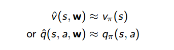

而且这样还有另一个好处，就是当agent进入一个没有被记录过的状态时候，查找表就会出错，但是函数依然可以输出，
只是我们很难保证输出合理。

## 几种值函数近似的方式

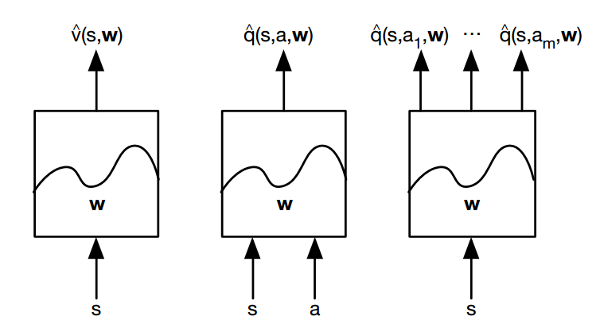

如上所示，大致上有三种方式。

* 第一种，输入S，输出状态的近似状态价值函数
* 第二种，输入S，a对，输出s状态下动作a的Q值的近似。
* 第三种也是求Q的近似，但是改变了模型的结构，只输入s，输出各个动作对应的Q值的近似。

当我们做免模型控制的时候，我们主要估计Q值，所以这里我主要看下后面两种方式，哪一种好呢？我们说一般是第二种好，
因为当我们需要近似的时候，说明状态的个数比较庞大，而一般我们的智能体的动作不会很大，比如Atari游戏，状态数以百万，每一个像素的
变化都是一个新的状态，但是动作可能只有几个，向左，向右，攻击之类的。所以造成了两个输入的维度相差太大，不利于训练。
其实还有一个好处，就是第二种模型，你需要每个状态动作对都输入一次，因此你计算了很多次网络的向前传播，而第三种方式只需要输入一次。

## 几种优化器

* 特征的线性组合
* 神经网络
* 决策树
* 近邻算法
* 傅里叶变换
* ...

我们主要研究前两个。主要有两个方法，增量式的方法和批方法。

## 增量方法

### 利用SGD进行状态价值函数近似

目标：找到参数向量w，能够最小化估计的价值和真实价值之间的均方误差。当然这里的真实价值我们假设上帝告诉你的，因为你不太可能知道的。

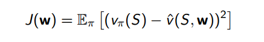

熟悉神经网络和深度学习的应该知道我们可以通过梯度下降来优化损失，梯度下降又有批梯度下降和随机梯度下降。

* BGD(批梯度下降)，找到局部最优

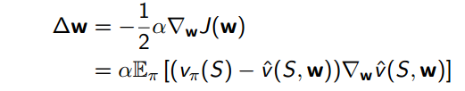

* SGD(随机梯度下降)，从梯度采样


### 特征向量

我们可以用特征向量来表示一个状态：

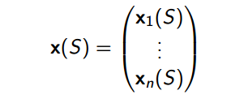

举个例子：
* 机器人与地标之间距离
* 股市行情的趋势
* ...

### 线性值函数近似

然后可以利用特征的线性组合来表示值函数：


目标函数是关于w的二次函数：

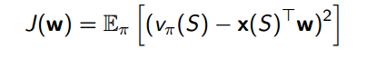

在这种情况下，SGD向全局最优收敛。

* 更新规则：


注意估值函数的梯度就是特征向量，你可以自己算一下看看。

### 增量预测算法

但是我们上面也说了，真实的值函数是上帝告诉你的，你如果不想每次都问上帝的话，必须要改变你的算法，用其他的东西来代替真实的值函数。
所以我们一般用target带代替值函数，什么target呢？MC中就是未来折扣回报Gt，TD(0)里就是TD target ：Rt+1 + γv^(St+1; w)，
TD(λ)里就是λ-return Gtλ。

所以相应的就有几个算法，Monte-Carlo with Value Function Approximation，TD Learning with Value Function Approximation，
TD(λ) with Value Function Approximation，思想都是一样的，区别只是target的形式不一样。

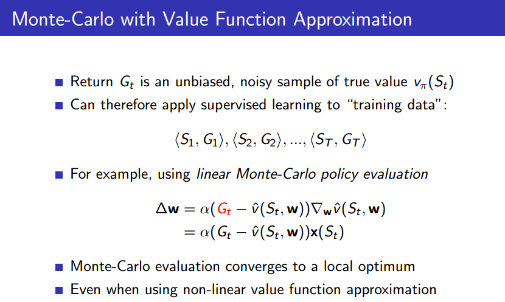

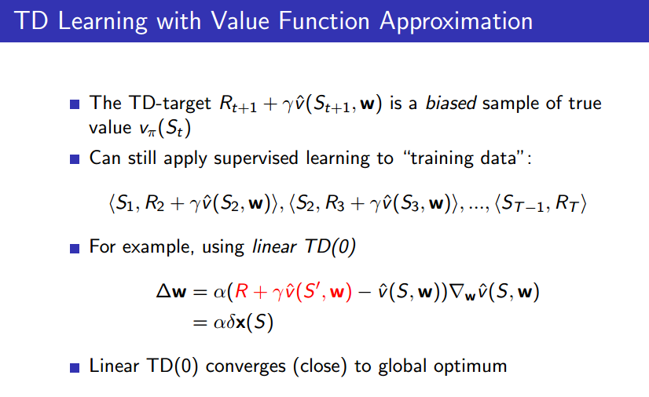

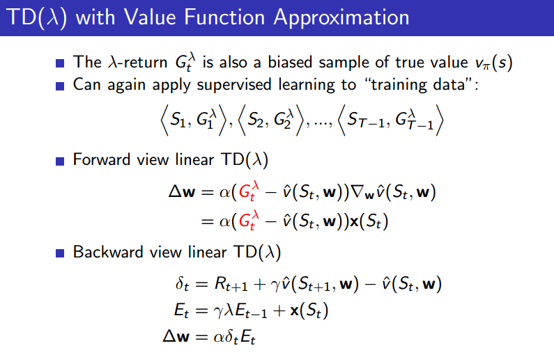

如果前面的笔记都理解了的话，这三个算法就很简单了。上面的图中每个算法还都以线性值函数近似举了个例子。

一定不要混淆：```MC，TD，TD(λ)改变的是target，也就是真实的值函数，线性非线性是估计的值函数的形式不同，比如已经讲过的线性值函数近似，
指的是误差项后半部分估值的计算方法```

### 值函数近似控制

前面讲的都是值函数的估计，也就是预测的部分，现在开始讲控制的部分。自然，如果还记得上一篇笔记中的内容的话，
我们现在就不应该估计状态价值函数了，而是应该估计动作价值函数Q，这样才能真正的免模型。

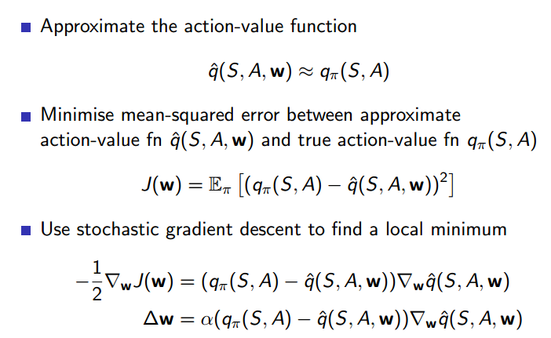

就不像前面说的具体了，只是稍作修改而已，具体看上图。同样也有线性动作价值函数近似。首先同样要定义一个特征向量，
只是不像前面，这里需要都加入动作A，具体来看下图：

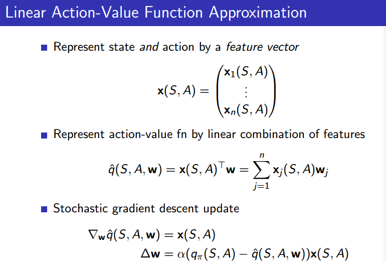

### 增量控制算法

增量控制算法和增量预测算法思想是一样的，只是V都换成了Q。也没什么特别注意的地方。

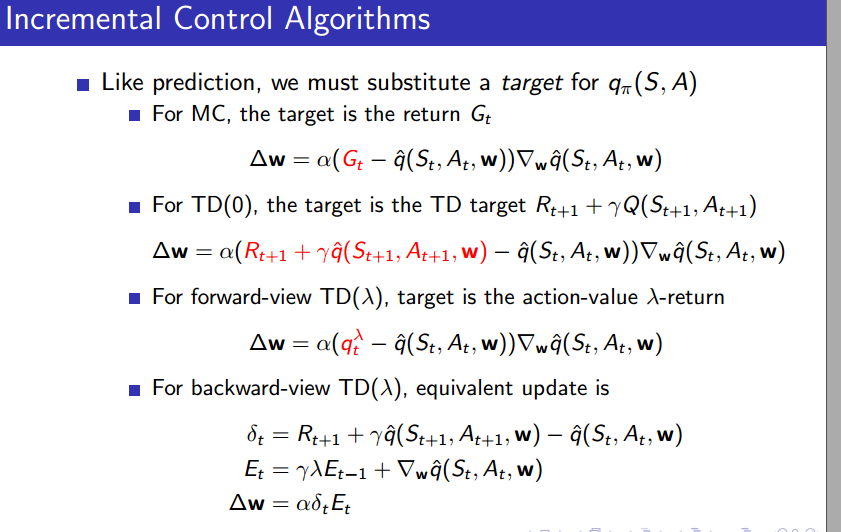

如果前面理解的话，上面的笔记的整个后半部分其实是一样的。

### 预测算法的收敛性

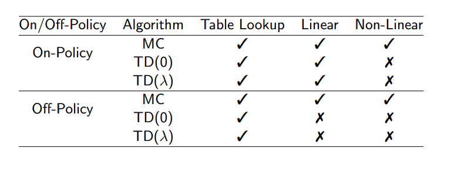

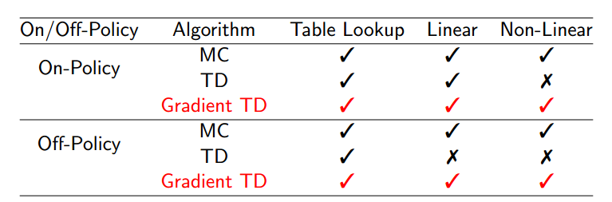

可以看到梯度TD还是有很大优势的。

### 控制算法的收敛性

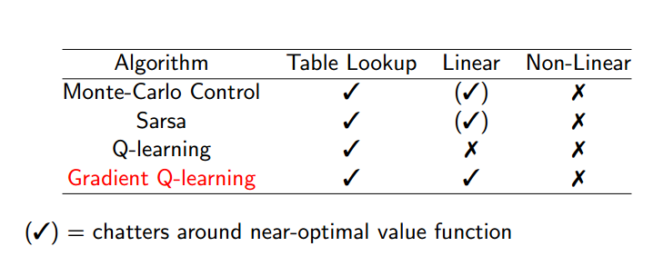

## 批方法

上面讲到现在都还是增量方法，现在开始讲批方法，批方法的优势就是sample efective，可以更大程度的利用训练数据。这些优势正是
增量方法没有的。

### 最小二乘法预测

最小二乘法预测算法尝试找到参数向量w，最小化估值和真实值的平方和误差，这里的真实值不用我说你也应该知道该怎么处理了。
因此下面这部分就不多说了，仔细看看笔记的前面就可以了。

###  Experience Replay

 Experience Replay是批处理方法的重要技巧，后面说道DQN算法的时候还有另一个技巧，fixed Q-target。这两个都是非常重要的思想。
 大致就是把以前的经验数据保存下来，然后批次采样训练网络，可以更大程度利用数据。

### 利用Experience Replay的SGD

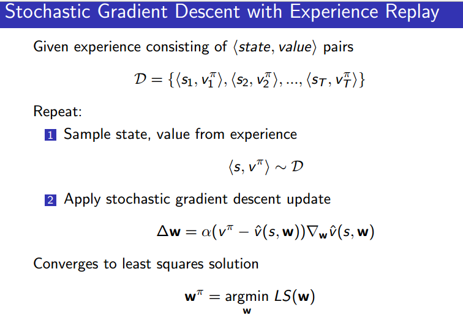

### DQN

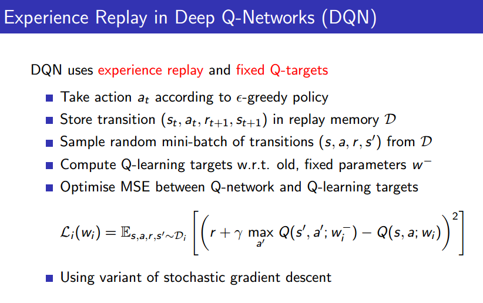

如上图所示，experience replay 和fixed Q-targets正是DQN所使用的两个技巧。
* 用epsilon-greedy policy选择动作
* (st; at; rt+1; st+1)保存起来，保存到D中
* 从D中随机批次采样，用于训练
* 利用固定的参数w-来计算Q target，这就是所谓的fixed Q-targets
* 然后优化损坏

DQN在Atar游戏中取得了非常不错的成绩，很多游戏击败了人类顶尖选手。

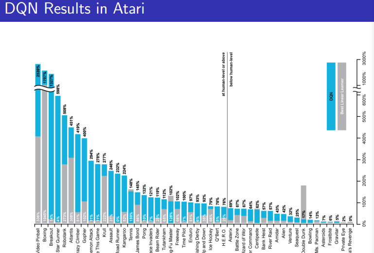
