# 第七课 策略梯度算法

课程ppt已上传为pdf。

## Policy-Based 强化学习

前面我们的课程其实都是Value-based learning，就是我们都是先进行策略的评估，也就是计算出值函数的值，V或者Q值，
然后再根据具体的V或者Q值按照greedy或者epsilon-greedy进行策略的选择，就像前面说的广义策略迭代一样。

但是其实这些方法都是有些绕了，为什么呢？因为我们的目的就是知道策略，最佳策略。在强化学习中，行动才是最终的目的。
但是前面的方法都是先求价值，然后再含蓄的从价值推出动作。那么我们可不可以不看价值，直接对策略进行求解分析呢？
这就是基于策略的强化学习，即Policy-Based RL。

## Policy-Based RL的优缺点

优点：
* 更好的收敛性质，因为是直接对策略进行操作的，而基于值的方法稍微绕了一些。
* 在高维和连续的动作空间里很有效。因为基于值的方法的话，必须要从价值中进行最大值的运算，动作很多的情况下很低效。
* 可以学习到随机的策略，这个很重要，下面会说到。

缺点：
* 比起全局最优，更倾向于收敛到局部最优
* 对策略进行估计很低效，而且高方差

## 随机策略的重要性

上面说到基于策略的RL可以学习到随机策略，那么为什么我们要学习随机策略呢？确定的策略哪边不好？
下面就以两个例子来说明。

* 剪刀石头布

剪刀石头布是完全随机的，因此用一个确定的策略，比如只出石头，是不太合理的，随机的策略更加合理。

* 方格世界


如上图所示，对于agent来说，两个灰色的区域是一摸一样的，因为左右完全对称，因此学习到的策略肯定也是一样的，
因此对于确定性策略来说，要么在灰色区域时都向左，要么都向右，但是无论那种，都有可能永远找不到宝藏，或许你可以采用
epsilon-greedy之类的带有一定随机性的策略，但是这将要花很长的时间去收敛。

```如果随机策略存在的话，一般都要比确定性策略优```

## 策略目标函数

我们可以用theta参数来表示策略π，但是我们如何衡量这个策略的好坏呢？有三种不同的目标函数可以做到，
这三种不需要纠结，后面会说到，其实是一样的。

* 片段的环境下使用开始价值
* 连续的环境下使用平均价值
* 连续的环境下使用每一步的平均回报

具体如下图：

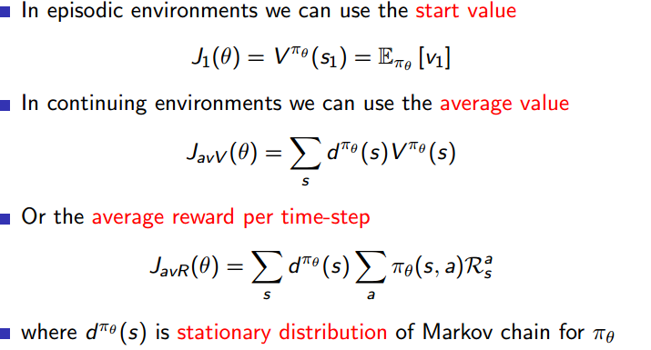

## 策略最优化

基于策略的RL问题其实就是一个最优化的问题，对于优化问题，我们一般可以采用基于梯度或者不基于梯度的方法。

* 基于梯度
    
    * 梯度下降
    
    * 牛顿方法
    
    * ...

* 不基于梯度
    
    * 爬山算法
    
    * 遗传算法
    
    * ...

我们主要看梯度下降算法。

## 梯度的计算

计算梯度可以直接用有限差分法，缺点很明显，就是很低效，噪声大，但是有时候却很高效。优点是即使策略不可微，也能计算。
我们一般不采用这种方法。

## Score Function

假设策略是可微的，我们来看看梯度应该怎么算。我们用似然比方法来改写梯度，如下：

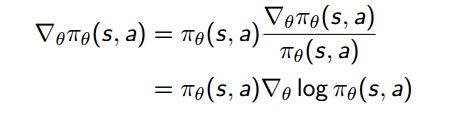

简单的运算，可以得到策略的梯度等于策略本身乘以Score Function，Score Function就是策略对数的梯度。

注意这里策略的梯度并不是我们说的策略梯度(Policy Gradient)，策略梯度是目标函数的梯度，也就是J的梯度。
策略的梯度不是策略梯度，有点绕，自己理解下。

## 一步MDP

下面我们真的开始计算策略梯度，也就是目标函数J的梯度，利用一步MDP来计算，从S出发，走一步，获得一个奖励r，
利用似然比方法计算策略梯度如下：

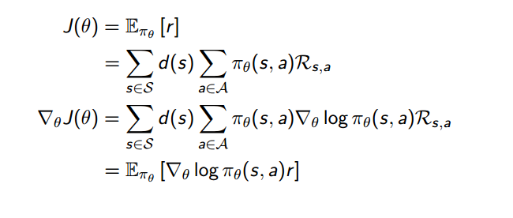

## 策略梯度定理

由上面的一步MDP推广到多步MDp的情况，就形成了策略梯度定理，这是非常重要的一个定理。一步奖励r用长期价值Q代替，
如下：

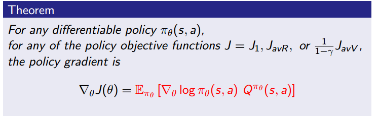

可以看到，无论目标函数是什么，策略梯度的公式是不变的，这就是上面我说的不用纠结目标函数的原因。
这里是一个期望，实际我们在模型无关的算法中就要拿掉这个期望了，因为我们是采样学习的，根据经验学习。每一步都确定了。

## Monte-Carlo Policy Gradient (REINFORCE)

REINFORCE算法应该算是最经典最基础的一个策略梯度算法了，他用SGD更新参数，遵循策略梯度定理，
并且用蒙特卡洛的目标，也就是未来的折扣回报来代替长期价值Q，这是一个Q的无偏差采样，正因为无偏差，所以
这个算法的方差很大，后面我们会采取一系列的方法来降低方差。

算法如下：

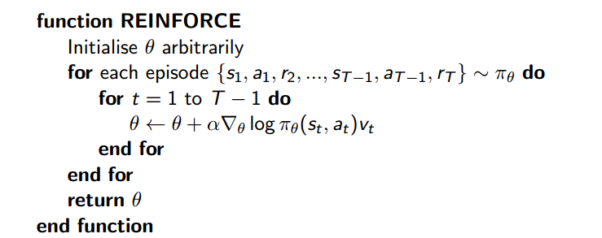

## Actor-critic

第一个降方差的手段就是引入Critic，因为上面说了REINFORCE算法是因为用Gt来代替Q才引来方差的，那么我们就
不用Gt，改用对Gt的估计来代替Q，而Critic就负责对Gt进行估计，如果你们还记得上一篇笔记的话，这其实就是一个函数近似器。

* Critic：通过参数w更新Q
* Actor： 在critic建议的方向上更新策略的参数theta

但是如下图，这里因为采用了近似器，所以策略梯度是近似的策略梯度，是有偏差的，所以不一定可以找到正确的Solution，
下面会解决这个问题。

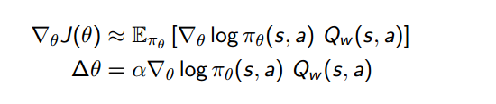

## 估计Q值

这里critic就是一个函数近似器，主要解决类似前面经常说的一个问题，策略评估。所以我们可以用以前的各种
策略评估方法来做Critic，像蒙特卡洛策略评估，时序差分学习等等，也可以是最小二乘策略评估之类的。

### Action-Value Actor-Critic

举个例子，用一个线性的值函数近似器来估计Q，Qw(s; a) = φ(s; a)'w，Critic用线性的TD(0)算法来更新w，
Actor用策略梯度来更新θ，这就是QAC算法。

回忆一下，线性的TD(0)算法是什么，这是上一篇笔记的内容，就是取代查找表的方法，用函数近似器来估计Q，
这里的函数近似器不是神经网络，是特征的线性组合，也就是上面的Qw(s; a) = φ(s; a)'w，所以叫做线性函数近似器。
TD(0)指的是目标target的表示方法，采用的是TD target，如果采用Gt，那就变成了线性MC算法，同理TD(γ)也一样。

下面给出QAC算法的具体伪代码：

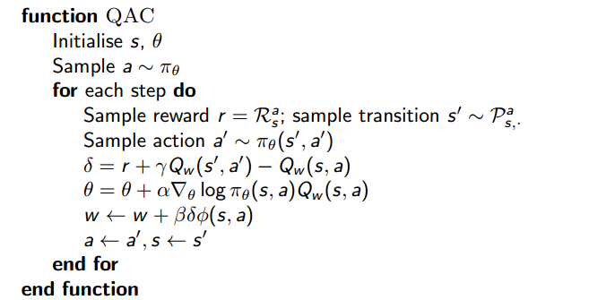

算法很清晰，两组参数，一组用来优化值函数近似器，一组用来有优化策略梯度的目标函数。

# Actor-Critic算法的偏差问题

上面说到引入值函数近似器，得到的策略梯度是近似的策略梯度，是有偏差的，所以不一定可以找到正确的Solution，
那么有没有一种值函数近似器是没有偏差的呢？还真的有，那就是兼容函数近似器，先给出兼容函数近似的定理：

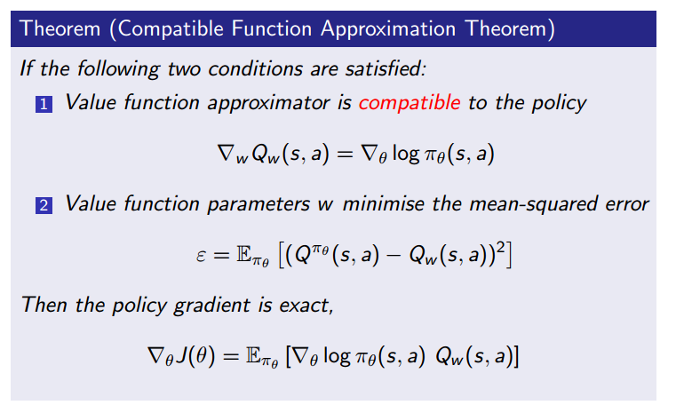

可以看到，只要满足两个条件，值函数近似器就可以称为兼容值函数近似器。
* 值函数近似器和策略兼容，具体看上图公式1
* 值函数参数w最小化均方误差，具体看公式2

这样的话，策略梯度就不再是近似的了，而是确切的就是策略梯度。

课件中给出了证明，可以自己看一下。

## Reducing Variance Using a Baseline

上面引用了Critic确实降低了方差，却还是不够，方差依然很大，为了进一步降低方差，引入了Baseline，我暂时翻译为基线。
我们从策略梯度中减去基线B(s)时，它可以降低方差，并且不会改变期望，如下：

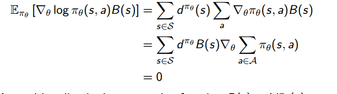

有点神奇，接下来就是选择什么样的基线了，一根比较好的选择就是状态值函数。B(s) = V πθ(s)，所以
我们就得到了优势函数A，Aπθ(s; a) = Qπθ(s; a) − V πθ(s)，替换我们策略梯度定理中的Q，得到新的
策略梯度为：

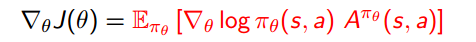

## 估计优势函数A

求解优势函数，最简单的方法就是分别求解Q和V，然后A=Q-V，相当于用两个函数近似器，一个估计Q，另一个估计V。

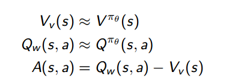

这样的参数就显得有些多了，能不能只用一个参数呢？答案肯定是可以的。
我们观察一下优势函数，A=Q-v，Q用TD target表示一下就是r + γV πθ(s0)，所以
A= r + γV πθ(s0) - V，这不就是TD error吗？

事实上，对于真实的状态价值函数V πθ(s)来说，它的TD error是优势函数A的一个无偏估计。所以我们可以用TD  error来替换
优势函数A，最后的策略梯度就变为：

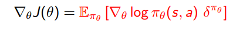

实际中，我们不知道真实状态值函数V，所以一般我们用近似的TD error：

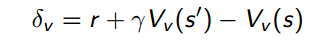

可以发现这时候只需要一个参数v就可以了。

## 小结

最后小结一下上面的思路流程：

基于策略的优势->策略梯度->MCPG，也就是REINFORCE算法->降方差，引入Critic，实现Actor-Critic算法->Critic带来了偏差，用兼容值函数近似解决
->进一步降低方差，使用基线B(s)

## 自然策略梯度

关于这部分，David也只是简单说一下，这个算法可以实现参数无关，根本原因就在于乘以一个Fisher信息阵的逆。相关的公式可以参考课件。
想要详细了解的可能要去查阅相关论文。

## 给出一张总结图

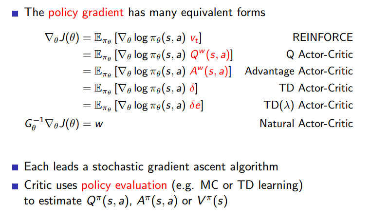
