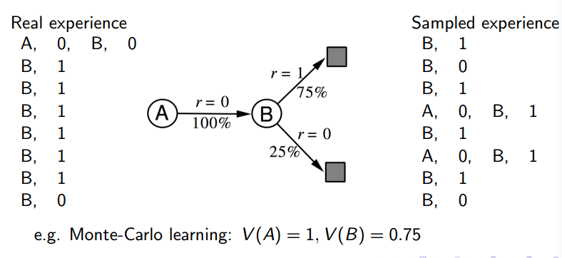
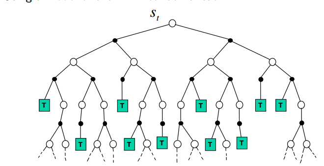
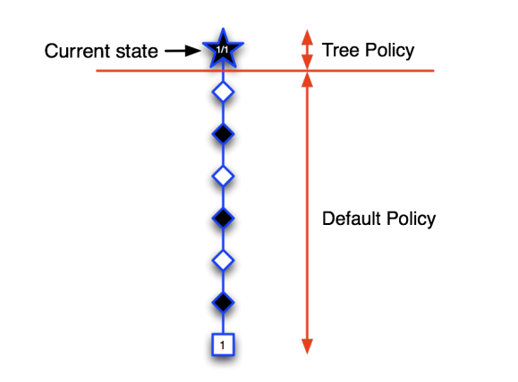

# 第八课 集成学习和计划

课程ppt已上传为pdf。

## 基于模型的强化学习

本课程之前所有的内容都没有提及到个体如何构建一个模拟环境的模型，自然也没有讲解个体构建一个模拟环境的模型对于解决MDP问题有何帮助。
通过构建一个模型，个体具备了一定程度的独立思考能力，即在与环境发生实际交互之前思考各种可能的行为其对能带给环境及自身的改变。通过个体的思考以及联合其与环
境的实际交互经验，个体在解决大规模MDP问题时可以取得更好的结果。

基于模型的RL如上所示：
首先通过实际经验学习一个模型，然后根据学习的模型进行规划。

## 基于模型的优劣势

我们能够通过监督学习高效率地习得模型，并且由于已知模型的形式，我们可以推断该模型的不确定程度。
当然，万事万物都有其两面性，“模型”既然带来了好处，那必然也
有其缺点：它将引入模型的误差，加上我们值函数估计的误差，这就有了两个误差源。

## 模型是什么

前面笔记看过来你应该大概知道了什么是模型，大致就是状态转移概率P和奖励函数R，其实这是因为我们假设状态空间S和动作空间
A是已知的。所以一个模型M就表示如下：

## 模型学习

通过上面那个图你也应该知道了，模型是从实际经验中学习的，也就是监督学习，样本就像下面一样：

其中是一个回归问题，给定(s, a)估计奖励r的值。而是一个密度估计问题，给定(s, a)，估计转移到不同状态的概率分布。
对于我们可以采用MSE作为损失函数，对于可以用KL-divergence作为损失函数。最小化这些损失函数，从而找到最优参数。

## 模型例子

根据使用的算法不同，可以有如下多种模型：查表式(Table lookup Model)、线性期望模型(Linear Expectation Model)、线性高斯模型(Linear Gaussian 
Model)、高斯决策模型(Gaussian Process Model)、和深信度神经网络模型(Deep Belief Network Model)等。下文主要以查表模型来解释模型的构建。

## 查表式模型

通过经历得到各状态行为转移概率和奖励，把这些数据存入表中，使用时直接检索。状态转移概率和奖励计算方法如下：

不过实际应用时，略有差别。在学习的每一步（time-step)，记录如下的状态转换（经历片段）：< S_t, A_t, R_{t+1}, S_{t+1} >
从模型采样构建虚拟经历时，从tuples中随机选择符合 <s,a,.,.> 的一个tuple，提供给个体进行价值或策略函数的更新。
这里的随机选择就体现了状态s的各种后续状态的概率分布。

## AB例子

借助这个例子来说明一下，之前在MC，TD区别那已经说过这个例子了：

这相当于我们利用经历构建了一个查表模型。随后我们可以使用这个模型，进行虚拟采样，从而进行“规划”。
之前我们学习的规划方法都可以用：
* 策略迭代
* 价值迭代
* 树搜索

但是这里我们用一个更好的方法，叫做Sample-Based Planning，基于采样的规划，不同于动态规划，
我们只利用模型来产生采样样本，然后用任意的免模型方法来解决：
* MC control
* Sarsa
* Q-learning

这种方法一般更加有效。

AB例子在应用采样之后就变成如下：

右边就是样本，然后根据样本，利用MC方法求解值函数。

## 不精确的模型
由于实际经历的不足或者一些无法避免的缺陷，我们通过实际经历学习得到的模型不可能是完美的模型： <P_{\eta}, R_{\eta}> \neq <P, R>
而基于模型的强化学习的能力是受到从近似的 MDP <S, A, P_{\eta}, R_{\eta}> 中学到的最优策略限制的。也就是说基于模型的强化学习最好的结果是受到学习到的
模型限制，如果模型本身是不准确的，那么“规划”过程可能会得到一个次优的策略。使用近似的模型解决MDP问题与使用价值函数或策略函数的近似表达来解决MDP问题并
不冲突，他们是从不同的角度来近似求解MDP问题，有时候构建一个模型来近似求解MDP比构建一个近似的价值函数或策略函数要更加方便，这是模型的可取之处。同时由
于个体经历的更新，模型处在一个动态变化的过程，当利用早期经历构建的模型被后认为存在很大错误，不适用当下经历的时候，需要放弃模型，
转而使用不基于模型的强化学习。此外可以在明确推理模型中增加一些不确定性。

## 整合架构Integrated Architectures

聊了这么多其实都是关于Model-Based RL的，现在我们来看一下本文的重点：Dyna Architectures。我们知道Model-Free方法是直接从real experience中学习值函
数/策略，而Model-Based方法则是从real experience中学习模型，然后利用该模型产生simulated experience，并从该经验中规划值函数/策略。那我们将这两者结
合将碰撞出什么样的火花？这就是Dyna的由来。Dyna如下所示：

具体算法如下：

大致思路就是先根据实际经验学习Q，然后更新模型，再根据模型进行基于采样的规划，根据模拟经验进一步更新Q。

## 基于模拟的搜索 Simulation-Based Search
在讲解基于模拟的搜索前，先回顾下前向搜索(Forward Search)算法。该算法通过往前看来采取最好的行为。这种算法把当前状态St作为根节点构建了一个搜索树
（Search Tree），使用MDP模型进行前向搜索。前向搜索不需要解决整个MDP，
而仅仅需要构建一个从当前状态开始与眼前的未来相关的次级（子）MDP。这相当于一个登山运动员的登山问题，在某一个时刻，
他只需要关注当前位置（状态）时应该采取什么样的行为才能更有利于登山（或者下撤），
而不需要考虑第二天中饭该吃什么，那是登顶并安全撤退后才要考虑的事情。

基于模拟的搜索(Simulation-Based Search) 是前向搜索的一种形式，它从当前时刻开始，
使用基于模拟采样的规划，构建一个关注与短期未来的前向搜索树，把这个搜索树作为一个学习资源，
然后使用Model Free的强化学习来寻找最优策略。

## 简单的蒙特卡洛搜索

简单的蒙特阿罗搜索ppt里说的也很清楚，如下，从当前节点模拟K个episodes，然后Q值用蒙特卡洛估计更新。
最后选择最大的Q值作为策略。

## 蒙特卡洛树搜索

蒙特卡洛树搜索和蒙特卡洛搜索是不一样的，上面的蒙特卡洛搜索只更新第一层子节点，也只保存这些节点，
而蒙特卡洛树搜索保存所有访问过的节点，不过不包括默认策略模拟的部分。

Evaluation：在模拟中从现在（real）的状态开始，simulate K episodes（用simulation policy），
用这些样本构造搜索树，并估计Q(s, a)，选择real action来控制real agent。

Simulation：这页主要将improve，其中在simulation时有两种策略，当我们遇到没有见过的状态时，
使用default policy，而遇到见过的策略时，则使用tree policy。我们会对tree policy进行改进，并且，
得到的策略是epsilon-greedy策略，也即随机性策略。这种方法是有收敛性保证的，
Q(s, a)将收敛到最优动作值函数，因而real policy将收敛到最优策略。

ppt中有围棋中应用MCTS的例子，很形象，我给出几幅图，很好理解。

一直继续模拟下去，在AlphaGo中模拟了1600次才落子一次。

## TD Search

将Q的更新方式换成Sarsa等TD Control方法就变成了TD Search。

对于TD搜索，其大体过程如下：

1. 从当前实际状态 s_t 开始，模拟一系列Episodes，在这一过程中使用状态行为价值作为节点录入搜索树，

2. 对搜索树内的每一个节点（状态行为对），估计其价值Q(s,a)

3. 对于模拟过程中的每一步，使用Sarsa学习更新行为价值：

4. 基于Q值，使用Ɛ-greedy或其他探索方法来生成行为。

在上述过程中，也可以使用针对Q的近似的函数式表达。

相比于MC搜索，TD搜索不必模拟Episode到终止状态，其仅聚焦于某一个节点的状态，
这对于一些有回路或众多旁路的节点来说更加有意义，这是因为在使用下一个节点估计当前节点的价值时，
下一个节点的价值信息可能已经是经过充分模拟探索了的，在此基础上更新的当前节点价值会更加准确。

## Dyna-2 算法

我们再次回到Dyna算法中来。Dyna算法一边从实际经历中学习，一遍从模拟的经历中学习。
如果我们把基于模拟的前向搜索应用到Dyna算法中来，就变成了Dyna-2算法。
使用该算法的个体维护了两套特征权重：一套反映了个体的长期记忆，
该记忆是从真实经历中使用TD学习得到，它反映了个体对于某一特定强化学习问题的普遍性的知识、经验；
另一套反映了个体的短期记忆，该记忆从基于模拟经历中使用TD搜索得到，它反映了个体对于某一特定强化学习在特定条件
（比如某一Episode、某一状态下）下的特定的、局部适用的知识、经验。
Dyna-2算法最终将两套特征权重下产生的价值综合起来进行决策，以期得到更优秀的策略。

这幅图你可以看到dyna 2算法的优越性。

